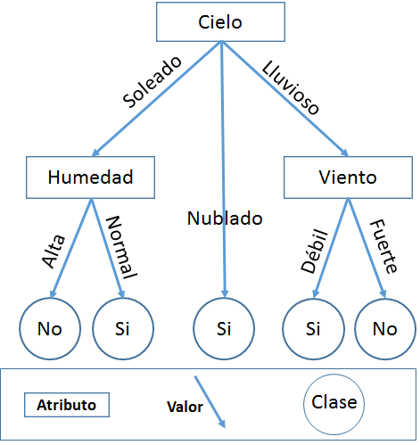
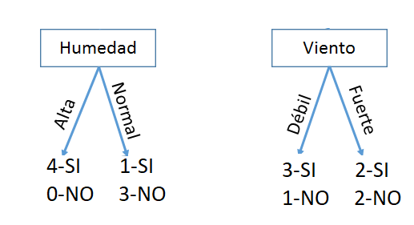
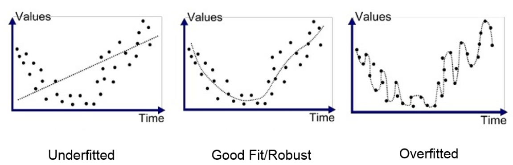

---
output:
   xaringan::moon_reader:
    css: xaringan-themer.css
    lib_dir: libs
    seal: false
    self_contained: true
    nature:
      highlightStyle: github
      highlightLines: false
      countIncrementalSlides: false
---

class: title-slide, center, middle
background-image: url(images/portada.jpg)
background-size: cover

#Práctica 3: 
#Árboles de Decisión

```{r setup, include = FALSE}
options(htmltools.dir.version = FALSE)
knitr::opts_chunk$set(warning = FALSE)
knitr::opts_chunk$set(message = FALSE)
library(knitr)
library(tidyverse)
# set default options
opts_chunk$set(echo=FALSE,
               collapse = TRUE,
               fig.width = 7.252,
               fig.height = 4,
               dpi = 300)
xaringanExtra::use_tile_view()
xaringanExtra::use_scribble(pen_size = 2)
xaringanExtra::use_clipboard()
xaringanExtra::use_webcam(width = 210, height = 220)
xaringanExtra::use_share_again()
xaringanExtra::use_tachyons()
xaringanExtra::style_share_again(
  share_buttons = c("twitter", "linkedin", "pocket")
)
xaringanExtra::use_panelset()
```

```{r xaringan-extra-styles, include=FALSE}
xaringanExtra::use_extra_styles(
  hover_code_line = TRUE,         #<<
  mute_unhighlighted_code = TRUE  #<<
)
```


```{r xaringan-logo, echo=FALSE}

xaringanExtra::use_fit_screen()
xaringanExtra::use_logo(
  image_url = "images/logo.png"
)
```

```{r xaringan-themer, include=FALSE, warning=FALSE}
library(xaringanthemer)
style_mono_accent(
  base_color = "#1c5253",
  header_font_google = google_font("Josefin Sans"),
  text_font_google   = google_font("Open Sans", "400", "300i"),
  code_font_google   = google_font("Fira Mono")

)

colors = c(
  red = "#f34213",
  purple = "#3e2f5b",
  orange = "#ff8811",
  green = "#136f63",
  white = "#FFFFFF",
  black="000000"
)
```

---
## Repaso: Árboles de decisión

.pull-left[

]

--

.pull-right[
- Cada nodo interno compara un atributo xi

- Una rama por cada valor de atributo xi=v

- Cada hoja asigna una clase y

- ¡Modelo interpretable!

]

---

## ¿Con qué atributo comenzar?

.center[

]

--

.bg-washed-light-purple.b--light-purple.ba.bw2.br2.shadow-5.ph2.mt2[
Una partición es buena si estamos “más seguros” de la clasificación después de haberla realizado
]

---
#¿Qué atributo es el mejor?

### **.purple[Entropía]**

Medida de incertidumbre de una variable aleatoria
.center[

$\LARGE H(Y) = -\sum_{i=1}^{k}p(Y=y_i)log_2 p(Y=y_i)$

]

--

.center[

### .black[A mayor incertidumbre, mayor entropía.]
]

### **.purple[Entropía Condicional]**

$H(Y|X) = -\sum_{j=1}^{v}p(X=x_j)\sum_{i=1}^{k}p(Y=y_i|X=x_j)log_2 p(Y=y_i| X=x_j)$

---
#¿Qué atributo es el mejor?

### **.purple[Ganancia de Información]**

Decrecimiento de entropía (incertidumbre) luego de la partición

--

.center[
$\LARGE IG(X)= H(Y)- H(Y|X)$
]

.center[**Elijo el atributo que me de mayor ganancia de información**]
---
#Impureza de Gini

.center[
$\LARGE G(x) = \sum_{i=0}^{N}p_x(x_i)(1-p_x(x_i))$
]
---

class: inverse, middle, center

#`r emo::ji("computer")`
#Parte 2

---
#Aprendizaje en Árboles de decisión

- Comenzar con un árbol vacío

--

- Generar una partición usando siguiente mejor atributo

--
- Usar, por ejemplo, ganancia de información y realizar el paso anterior de manera recursiva

---

## Hiperparámetro

.bg-washed-light-purple.b--light-purple.ba.bw2.br3.shadow-5.ph4.mt4[
Valores no aprendidos por el algoritmo desde los datos y por ende deben ser seteados antes de entrenar el algoritmo.

]

--

### En árboles de decisión:

Funcionan bien para datos no linealmente separables.

- `max_depth` : máxima profundidad del árbol

- `min_samples_split`: El número mínimo de muestras requeridas para dividir un nodo interno

- `min_samples_leaf`: El número mínimo de muestras requeridas para estar en un nodo hoja.

- `criterion`: Gini o Entropy
---
class: inverse, middle, center

#`r emo::ji("computer")`
#Parte 3 y 4

---
# Sobreajuste

- El error de entrenamiento es siempre cero 

- Poca capacidad de generalización.

.center[

]

--

.footnote[Imagen extraída de [aquí](https://bookdown.org/content/2031/arboles-de-decision-parte-i.html)]
.bg-washed-light-purple.b--light-purple.ba.bw2.br2.shadow-5.ph3.mt2[
El objetivo de un modelo de Machine Learning es que generalice bien frente a nuevos datos o datos no vistos por el modelo (set de testeo)
]

---
## Ventajas `r emo::ji("bulb")`

- Fácil de entender
- Util en exploración de datos:identificar importancia de variables a partir de cientos de variables.
- El tipo de datos no es una restricción
- Es un método no paramétrico (i.e., no hay suposición acerca del espacio de distribución y la estructura del clasificador)

## Desventajas `r emo::ji("bulb")`

- Sobreajuste
- Pérdida de información al categorizar variables continuas
- Inestables debido a que pequeñas variaciones en el dataset pueden generar modelos muy diferentes.

