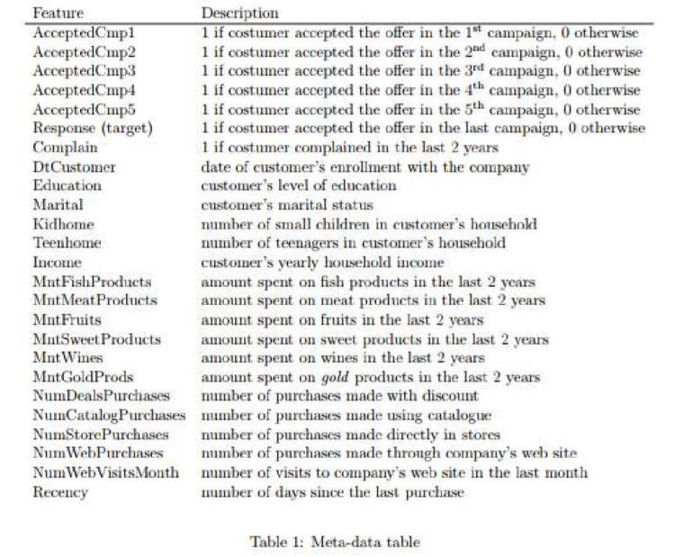
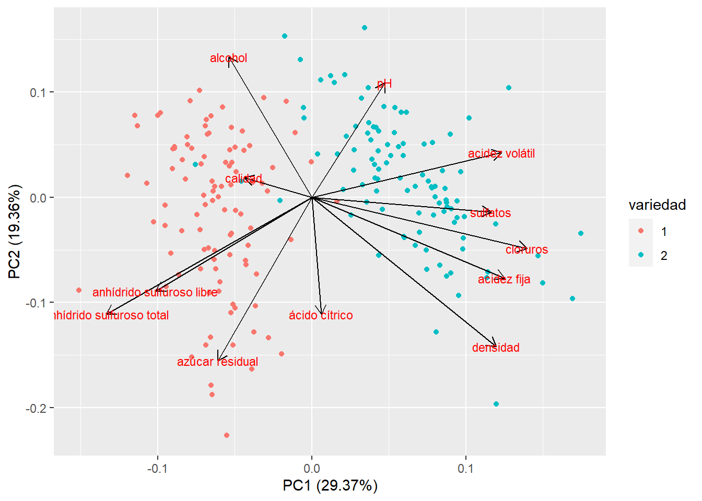

```{r setup, include=FALSE}
knitr::opts_chunk$set(echo = TRUE)
knitr::opts_chunk$set(message = FALSE)
knitr::opts_chunk$set(warning = FALSE)
library(tidyverse)
library(ggrepel)
library(gsheet)
library(rgl)
library(plot3D)
library(GGally)
library(reshape2)
library(plotly)
library(kableExtra)
```

**Contexto**

Una empresa de alimentos está planeando lanzar una campaña de marketing el próximo mes con el objetivo de maximizar las ganancias. Se diseño una campaña piloto con 2,240 clientes. Aquellos que compraron la oferta fueron etiquetados como exitosos.


# Parte 1

# Análisis exploratorio 📊

Comenzamos con un breve análisis exploratorio para ir conociendo las relaciones entre las variables y sus distribuciones.

Carga de la base de datos

```{r}
df <-read.csv("ifood_df.csv")
glimpse(df)
```
**Descripción de las columnas del dataset**



¿Hay valores faltantes?

```{r}
sum(is.na(df))# para saber cuantos na hay en la base de datos
```
¿Hay datos duplicados?

```{r}
any(duplicated(df))
```

```{r}
set.seed(11) 

df_sample <- dplyr::distinct(df) |> #elimino datos repetidos
           sample_n(350)

df_num <- df_sample |> 
          select(1, 5:13, 25)#selecciono columnas de interes 

df_sample$marital_Single <- as.factor(df_sample$marital_Single)
df_sample$marital_Married <- as.factor(df_sample$marital_Married)
df_sample$Response <- as.factor(df_sample$Response)
```

```{r}
hist(df_sample$Age, 
     main = "Histograma de la edad",
     xlab = "Edad",
     ylab = "Frecuencia",
     col = "salmon",
     border = "black"
)
```

```{r}
recuentos <- table(df_sample$marital_Married)

# Calcular los porcentajes
porcentajes <- round(prop.table(recuentos) * 100)

# Crear las etiquetas con las categorías y los porcentajes
etiquetas <- paste(names(recuentos),"  \n", porcentajes, "%", sep = "")

# Crear el gráfico de torta con las etiquetas de categorías y porcentajes
pie(recuentos, labels = etiquetas, main="Personas casadas (%)")
```

```{r}
# scatter plot

ggplot(df_sample, aes(x=MntWines, y=Income)) + 
  geom_point( colour='#56B4E9', shape=19)+
  xlab("Cantidad de vinos comprados")+
  ylab("Income")+
  theme_bw()
```

Trabajamos unicamente con las variables numéricas.

```{r}
data_long <- df_sample |> 
             select(1, 5:13,24, 25) |> 
             melt()
ggplot(data_long, aes(x=variable, y=value)) + 
    geom_boxplot() +
    facet_wrap(~variable, scale="free")
```

```{r}
ggplot(data_long, aes(x=variable, y=value, fill= Response)) + 
    geom_boxplot() +
    facet_wrap(~variable, scale="free")
```


**Representación tridimensional de variables**


```{r}
scatter3D(df_sample$MntWines, df_sample$NumWebPurchases, df_sample$Age, 
          phi = 0, 
          bty = "g",
          pch = 20, 
          cex = 2, 
          ticktype = "detailed", 
          colvar=NULL, 
          col = "blue",
          xlab="MntWines",
          ylab="NumWebPurchases",
          zlab="Age")
```

```{r}
mycolors <- c('royalblue1', 'red')
df_sample$color <- mycolors[ as.numeric(df_sample$Response) ]

plot3d(df_sample$MntWines, df_sample$NumWebPurchases, df_sample$Age, 
          type = 's', 
          radius = 10,
          col = df_sample$color,
          xlab="MntWines",
          ylab="NumWebPurchases",
          zlab="Age")

rglwidget()
```

**Correlograma**

```{r}
#Matriz de correlación
library(corrplot)

m_cor <- cor(df_num) 

# representa la matriz de correlaciones mediante círculos
corrplot(m_cor,
         method="circle",
         type = "upper",
         diag= FALSE) 
```

# Matriz de Varianzas y covarianzas

```{r}
m_cov <-round(cov(df_num),2)

m_cov |> knitr::kable(format = "html") |> 
  kable_styling() 
```

Las varianzas tienen distintas unidades: No son comparables!!

Y la traza??

```{r}
traza_cov  <-sum(diag(m_cov))
traza_cov
```

La función `eigen()` calcula los autovectores y autovalores y los almacena en una lista bajo el nombre de _vectors_ y _values_, respectivamente.

```{r}
m_cov_AA <- eigen(m_cov)
autovalores_cov <- m_cov_AA$values #autovalores
round(autovalores_cov, 2)
```

Y si estandarizo los datos?

```{r}
datos_estandarizados <- data.frame(scale(df_num))

#calculo la matriz de covarianzas en los datos estandarizados
round(cov(datos_estandarizados),2)
```

# Matriz de Correlaciones

```{r}
m_cor <-round(cor(df_num),2)
m_cor |> knitr::kable(format = "html") |> 
  kable_styling() 
```

Y la traza?

```{r}
traza_cor  <-sum(diag(m_cor))
traza_cor
```

Traza = p (número de variables)

```{r}
desc_mat_cor <-eigen(m_cor)
autovalores_cor <-desc_mat_cor$values
round(autovalores_cor,2)
```

```{r}
print(sum(round(autovalores_cor,2)))
print(sum(round(autovalores_cov, 2)))
```

**Conclusión**:la suma de los autovalores de cada matriz coincide con su respectiva traza

## ¿Que matriz usar para extraer a los componentes?

**Matriz de varianzas y covarianzas**

-   Cuando las variables están en la misma escala

-   Da más peso a las variables con mayor varianza

-   En la interpretación interesa la diferencia entre varianzas

**Matriz de correlación**:

-   Cuando las variables están en distintas escalas o con valores muy distintos

-   Da el mismo peso a todas las variables

# PCA

**Objetivo del PCA**


Reducir el número de variables generando **nuevas variables que resuman la información original**. Revelar patrones en los datos que pueden no ser detectados al analizar las variables por separado.

- Reducción de dimensionalidad
- Detección de anomalías
- Decorrelación: Algunos algoritmos de aprendizaje automático tienen dificultades con características altamente correlacionadas. PCA transforma características correlacionadas en componentes no correlacionados, lo que podría ser más fácil para que el algoritmo trabaje con ellas

Por defecto, `prcomp()` centra las variables para que tengan media cero, pero si se quiere además que su desviación estándar sea de uno, hay que indicar *scale = TRUE*.

```{r}
pca <- prcomp(df_num,
              scale = TRUE)# con datos estandarizados
names(pca)
```

`center`: contienen la media de las variables previa estandarización (en la escala original)

`scale`: contienen desviación típica de las variables previa estandarización (en la escala original)

`rotation`: contiene los *loadings*

## Cargas o _loadings_

```{r}

round(pca$rotation,2) |> knitr::kable(format = "html") |> 
  kable_styling() 
```

```{r}
contrib <- as.matrix(round(pca$rotation,2))
corrplot(contrib,is.corr=FALSE)
```

¿Cuál seria la combinación lineal de la primer componente?

$\ PC1= 0.39*Income+ 0.35*MntWines + 0.33*MntFruits +0.36*MntMeatProducts +0.32*MntFishProducts +0.33*MntSweetProducts +0.27*MntGoldProds- 0.06*NumDealsPurchases+ 0.25*NumWebPurchases+ 0.37*NumCatalogPurchases+ 0.08*Age$

Y de la segunda componente (PCA 2)??

```{r echo=TRUE}
#loadings

carga1 = data.frame(cbind(X=1:length(df_num),
                          primeracarga=data.frame(pca$rotation)[,1]))
carga2 = data.frame(cbind(X=1:length(df_num),
                          segundacarga=data.frame(pca$rotation)[,2]))
cbind(carga1,carga2)
```

```{r echo=TRUE}
ggplot(carga1, aes(colnames(df_num) ,primeracarga)) + 
       geom_bar (stat="identity" , 
       position="dodge" ,
       fill ="royalblue" ,
       width =0.5 ) + xlab( 'Variables' ) + ylab('Primera carga' )+ theme(axis.text.x = element_text(angle = 45, hjust = 1))

```

## Autovalores

¿Qué proporción de la variabilidad total es explicada por las componentes?

```{r}
pca$sdev^2 # autovalores
```

```{r}
prop_varianza <- pca$sdev^2 / sum(pca$sdev^2)
prop_varianza
```

```{r}
ggplot(data = data.frame(prop_varianza, pc = 1:11),
       aes(x = pc, y = prop_varianza)) +
  geom_col(width = 0.4) +
  scale_y_continuous(limits = c(0,0.15)) +
  theme_bw() +
  labs(x = "Componente principal",
       y = "Prop. de varianza explicada")
```

```{r}
prop_varianza <- pca$sdev^2 / sum(pca$sdev^2)
prop_varianza_acum <- cumsum(prop_varianza)
prop_varianza_acum
```

```{r}
ggplot(data = data.frame(prop_varianza_acum, pc = 1:11),
       aes(x = pc, y = prop_varianza_acum, group = 1)) +
  geom_point() +
  geom_line() +
  theme_bw() +
  labs(x = "Componente principal",
       y = "Prop. varianza explicada acumulada")
```

# ¿Cuántas CPs elegir?

## Criterio 1: Porcentaje de variabilidad explicada

Se define un porcentaje de variabilidad mínimo que se desea explicar y se toman las primeras m componentes que alcanzan este porcentaje de explicación.

Por ejemplo se elige un porcentaje de 80% de variabilidad.

```{r}
round(prop_varianza_acum*100,2)# llevo datos a porcentaje
```
## Criterio 2: Criterio de Kaiser

Consiste en retener las m primeras componentes tales que sus autovalores resulten iguales o mayores que 1.

```{r}
screeplot(pca, type = "l", npcs = 11)
abline(h = 1, col="red", lty=5)
legend("topright", legend=c("Eigenvalue = 1"),
       col=c("red"), lty=5, cex=0.6)
```

## Criterio 3: Criterio del bastón roto

Si la proporción de variabilidad explicada por $Y1, Y2, · · ·, Ym$ se estabiliza a partir de un cierto valor de CP, entonces aumentar la dimensión no aportaría cambios significativos.

```{r}
library(factoextra)

fviz_eig(pca, ncp =11, addlabels = TRUE, main="")
```

# Parte 2

# Vizualización

- Los objetos son ordenados en función de su puntaje en cada uno de los componentes analizados

- Las variables son representadas como vectores

## _Scores_

Se estandarizan las variables originales y luego con la fórmula de la combinación lineal correspondiente para cada CP, se calculan los scores o puntajes.

```{r}
pca$x[,1]# scores para la primer componente (PC1)
```
```{r}
res.ind <- get_pca_ind(pca)
knitr::kable(head(res.ind$coord,10), format = "html") %>% 
  kableExtra::kable_styling() %>%
  kableExtra::scroll_box(width = "100%")
```

## Biplot ✍🏽

```{r}
library(ggfortify)

autoplot(pca, 
         data = df_num, 
         loadings = TRUE, 
         loadings.colour = 'black',
         loadings.label = TRUE, 
         loadings.label.size = 5)
```

```{r}
df_sample$Response <- as.factor(df_sample$Response)

autoplot(pca, 
         data = df_sample, 
         colour = 'Response',
         loadings = TRUE, 
         loadings.colour = 'black',
         loadings.label = TRUE, 
         loadings.label.size = 5)
```

Vizualicemos las primeras 3 componentes:

```{r}
componentes <- pca[["x"]]
componentes <- data.frame(componentes)
componentes = cbind(componentes, df_sample$Response)

titulo = 'Primeras 3 CPs'

fig <- plot_ly(componentes, 
               x = ~PC1, 
               y = ~PC2, 
               z = ~PC3, 
               color = ~df_sample$Response,
               colors = c('#636EFA','#EF553B') ) |> 
   add_markers(size = 12)
 
fig <- fig |> 
  layout(
    title = titulo,
    scene = list(bgcolor = "#f3f2fc")
)

fig
```

## ¿Qué información podemos sacar del biplot? 🤔

Tener en cuenta lo siguiente:

- Si se es el/la experto/a de dominio (o se le puede consultar) se puede dar una interpretación a qué aspecto del tema se refiere PC1 y PC2, considerando los _loadings_ de las varibles originales.

- Si dos variables forman ángulos pequeños; esto nos estaría diciendo que las variables están muy correlacionadas (en este ejemplo sería el caso de `NumCatalogPurchases` y `Income`)

- Si dos variables forman ángulos de 90°, entonces nos indica que ambas variables **no** están correlacionadas (por ejemplo `MntWines` y `NumDealsPurchases`).

- Los resultados del PCA son sensibles a la presencia de _outliers_ por lo que pueden distorsionar el ordenamiento.

## ¿Y si se quiere graficar el PC2 vs PC3?

```{r}
autoplot(pca, x = 2, y = 3,
         data = df_num, 
         loadings = TRUE, 
         loadings.colour = 'blue',
         loadings.label = TRUE, 
         loadings.label.size = 4)
```

```{r}
library(FactoMineR)
num.pca <- PCA(df_num,              
               scale.unit= TRUE,
               ncp=6,
               graph = FALSE)
names(num.pca)
```
```{r}
num.pca$eig
```
```{r}
# Default plot
fviz_pca_ind(num.pca, 
             label="none")
```

```{r}
fviz_pca_biplot(num.pca, 
  habillage = df_sample$Response, 
  col.var = "red", 
  label = "var") +
  scale_color_brewer(palette="Dark2")+
  theme_minimal()
```

# Consideraciones importantes 💡

❌  PCA no  es el modelo final, es una herramienta previa.

❌ No es una técnica de inferencia estadística

✔️ El PCA es mas eficiente si las variables se relacionan linealmente.

✔️ _Outliers_ pueden distorsionar el ordenamiento.

# PCA robusto 💪🏽

**Técnicas robustas**

Una de las alternativas robustas propuestas es *Minimun Covariance Determinant* (MCD), y otra es el *Minimum volume ellipsoid* (MVE).

Para mas detalle de cada técnica mirar los papers correspondientes:

1- Link de descarga [aqui](https://www.researchgate.net/publication/354058635_Robust_Principal_Component_Analysis_Using_Minimum_Covariance_Determinant_Estimator) para MCD

2- Link de descarga [aquí](https://www.researchgate.net/publication/229803108_Minimum_Volume_Ellipsoid/link/59e1d3560f7e9b97fbe72fa9/download) para MVE.

Se agregan *outliers* a la base de datos

```{r}
df_out<-rbind(c (5000, 8000, 3, 100, 20, 300, 5, 10, 150, 10, 81) ,
              c (100000, 9000, 3, 1000, 20, 200, 500, 10, 15, 100, 11) ,
              c (100000, 700, 100, 100, 20, 30, 500, 10, 100, 10, 15),
              df_num)

glimpse(df_out)
```
## 1- Mínimo Determinante de la Covariancia (MCD)

```{r}
pca_mcd <-princomp(df_out, 
                   cor=TRUE,
                   scores=TRUE,
                   covmat=MASS::cov.mcd(df_out))#se especifica MCD
summary(pca_mcd)
```
## 2- Elipsoide de volumen mínimo (MVE)

Esta estimación busca el elipsoide de volumen mínimo que contiene al menos la mitad de los puntos del conjunto de datos.

```{r}
pca_mve <-princomp(df_out, 
                   cor=TRUE, 
                   scores=TRUE,
                   covmat=MASS::cov.mve(df_out))#se especifica MVE
summary(pca_mve)
```

```{r}
library(ggpubr)

par(mfrow=c(2,1))
p1 <-fviz_eig(pca_mve, ncp =5, addlabels = TRUE, main="MVE")
p2<- fviz_eig(pca_mcd, ncp =5, addlabels = TRUE, main="MCD")

ggarrange(p1,p2, nrow = 1, ncol = 2)
```


```{r}
screeplot(pca_mve, type = "l", npcs = 7)
abline(h = 1, col="red", lty=5)
legend("topright", legend=c("Eigenvalue = 1"),
col=c("red"), lty=5, cex=0.6)
```


## Comparando la varianza explicada entre PCA no robusto y MVE

```{r}
num.pca.out <- PCA(df_out,              
               scale.unit= TRUE,
               ncp=6,
               graph = FALSE)

fviz_pca_biplot(num.pca.out, 
  col.var = "red", 
  label = "var") +
  scale_color_brewer(palette="Dark2")+
  theme_minimal()
```

```{r}
p3 <-fviz_eig(num.pca.out, 
              ncp =5, 
              addlabels = TRUE, 
              main="No robusto",
              barfill = "#69b3a2",
              barcolor = "#69b3a2")

ggarrange(p2,p3, nrow = 1, ncol = 2)
```

# Ejercitación 🤔

A partir de los datos obtenidos de un estudio sobre las preferencias de vinos, se realizó un PCA y a continuación se muestra el biplot del mismo. Para mas detalles del estudio ver el siguiente [link](https://sci-hub.hlgczx.com/10.1016/j.dss.2009.05.016). Interprete el biplot.



La primer componente explica el 29,37% de la variabilidad total de clientes. 

Las variables que mas se asocian positivamente con la primer componente son... 
En cambio, ... se asociaron negativamente a la primer componente. 

La primer componente diferencia a los vinos tintos de los vinos blancos especialmente referido a los minerales que posee y los sulfitos.

La segunda componente parece captar la variabilidad relacionada con los años en barrica (mayor acidez y alcohol).


```{r}
sessionInfo()
```

