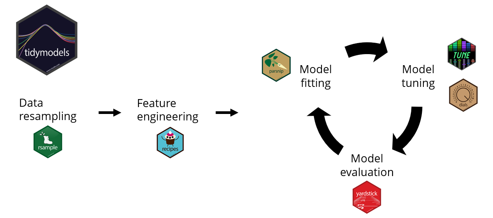
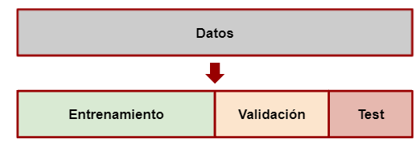

# ¿Qué es [Tidymodels](https://www.tidymodels.org/)?

Tidymodels ofrece un flujo de trabajo estructurado, reproducible y consistente que facilita y mejora la implementación y evaluación de modelos de regresión y clasificación en R.

{fig-align="center" width=500}


> <i class='fas fa-code-branch pr2'></i> Si no tenés instalado `tidymodels` podés hacerlo corriendo el siguiente código

``` r
install.packages("tidymodels")
```

Los paquetes mas relevantes:

-   `rsample`: para realizar la división del dataset en entrenamiento, validación y testeo.

-   `recipes`: para el preprocesamiento

-   `parnship`: para especificar el modelo

-   `yardstick`: para evaluar el modelo


```{r echo=TRUE, message=FALSE, warning=FALSE}
library(tidymodels)
```


Veamos un ejemplo con iris

## Preprocesamiento

### División del dataset

{fig-align="center" width=300}

```{r}
g <- ggplot(iris, aes(Species))
g + geom_bar()
```

con `rsample::initial_split()` creamos una división entre train y test

```{r}
set.seed(1234)
iris_split <- initial_split(iris, 
                            prop = 0.6,
                            strata = Species)#util para datos desbalanceados
iris_split
```
Cuando llamamos al objeto `iris_split` nos muestra la cantidad de elementos en train/test/total

Si queremos recuperar el dataset de entrenamiento, utilizamos el comando `training()`

```{r}
iris_split %>%
  training()  
```

### Receta de transformaciones

Con `recipes::recipe()` indicamos que comenzamos un pipeline de preprocesamiento, indicando cúal es la variable a predecir, con `Species ~ .`.

El objetivo de realizar el preprocesamiento de esta manera es que para muchas etapas del preprocesamiento, como puede ser el cálculo de la media para la imputación, sólo podemos utilizar la información del set de entrenamiento para evitar el _data leakage_. Por ello, si construimos un pipeline donde se calcula todo sobre entrenamiento, después es más sencillo reutilizarlo en test, sin cometer errores de este tipo.


`recipe()` Empieza un nuevo set de transformaciones para ser aplicadas. 

`prep()` Ejecuta las transformaciones en el set de entrenamiento

Cada tranformación es un _step_(paso). Las funciones son tipos específicos de pasos. En este caso utilizamos:

`step_corr()` Elimina las variables que tienen una correlación alta con otras variables
`step_center()` Centra los datos para que tengan media cero
`step_scale()` Normaliza los datos para que tengan desvío estandar de 1.

Las funciones `all_predictors` y `all_outcomes` ayudan a especificar sobre qué valores hay que realizar las transformaciones.

```{r warning=FALSE}
iris_recipe <- training(iris_split) %>%
  recipe(Species ~.) %>%
  step_corr(all_predictors()) %>%
  step_scale(all_predictors(), -all_outcomes()) %>%
  prep()

iris_recipe
```


### Aplicamos la receta en los datos de test y train

Con la función `bake()` podemos aplicar la _receta_ que preparamos antes para los datos de entrenamiento. Para ello el primer objeto que pasamos es la _receta_ y como parámetro de _bake_ pasamos el dataset de test (recuperado con la función `testing` de rsample)

```{r warning=FALSE}
iris_test <- iris_recipe %>%
  bake(testing(iris_split)) 

iris_test
```


```{r warning=FALSE}
iris_train <- iris_recipe %>%
  bake(training(iris_split)) 

iris_train
```

## Entrenamiento de modelos

En R hay muchos paquetes que implementan el mismo tipo de modelo. Normalmente cada implementación define los parámetros del modelo de forma distinta. Por ejemplo, para el modelo Random Forest, la librería `ranger` define el número de árboles como num.trees, mientras que la librería `randomForest` lo nombra ntree. 

Se puede entrenar cualquier modelo (que este incluído en `tidymodels`) siguiendo los pasos que se muestran a continuación.

1- Especificar el modelo (eg. Regresión logística, Random Forest, SVM, etc)

2- Con `set_engine()` se especifíca la familia de modelos

3- Con `set_mode()` se especifica el tipo de modelo a entrenarse (regresión o clasificación)

4- Usar la función `fit ()` para entrenar el modelo y, dentro de eso, debe proporcionar la notación de la fórmula y el conjunto de datos

```{r}
##Con los hiperparámetros por default

#SVM
model_SVM <-
  svm_rbf() %>% 
  set_mode("classification") %>% 
  set_engine("kernlab") %>% 
  fit(Species ~ ., data = iris_train)


#Random Forest

model_RF <- rand_forest() %>% 
  set_engine("ranger") %>%   
  set_mode("classification") %>% 
  set_args(trees = 100) %>% 
  fit(Species ~ ., data = iris_train)
```


## Predicciones en test y train

Para predecir los datos de test y train utilizamos la conocida función `predict`. Sin embargo, cuando utilizamos esta función sobre un objeto de la librería `parsnip` devuelve un _tibble_

Para agregar las predicciones a los datos de test podemos utilizar la función `bind_cols`


```{r}
# SVM - Train
iris_train_svm <- bind_cols(
  predict(model_SVM, iris_train, type = "class"),
  predict(model_SVM, iris_train, type = "prob")
) %>%
  bind_cols(iris_train)

# SVM - Test
iris_test_svm <- bind_cols(
  predict(model_SVM, iris_test, type = "class"),
  predict(model_SVM, iris_test, type = "prob")
) %>%
  bind_cols(iris_test)

# Random Forest - Train
iris_train_rf <- bind_cols(
  predict(model_RF, iris_train, type = "class"),
  predict(model_RF, iris_train, type = "prob")
) %>%
  bind_cols(iris_train)

# Random Forest - Test
iris_test_rf <- bind_cols(
  predict(model_RF, iris_test, type = "class"),
  predict(model_RF, iris_test, type = "prob")
) %>%
  bind_cols(iris_test)
```


## Métricas

{fig-align="center"}

Recordemos que:

$accuracy = \frac{TP+TN}{TP+FP+FN+TN}$

$sensitivity = recall = \frac{TP}{TP+FN}$

$specificity = \frac{TN}{TN+FP}$

$precision = \frac{TP}{TP+FP}$

**Curvas ROC**

Las curvas ROC (_Receiver Operating Characteristic_) permiten evaluar la capacidad de un modelo de clasificación para discriminar entre clases considerando distintos umbrales de decisión. La curva representa la sensibilidad frente a la tasa de falsos positivos (1 - especificidad) para diferentes valores del umbral.

AUC= área bajo la curva ROC, que también sirve para comparar modelos.

{fig-align="center"}

Como `iris` es un problema de clasificación multiclase, las curvas ROC se construyen utilizando un enfoque _one-vs-rest_. De esta manera, se evalúa la capacidad del modelo para distinguir cada especie respecto de las otras dos.

Con la función `yardstick::metrics()` podemos medir la performance del modelo. Elige automáticamente las métricas apropiadas dado el tipo de modelo. Necesitamos aclarar cuáles son los datos predichos,_estimate_ y reales, _truth_.

```{r}

metricas <- metric_set(
  accuracy,
  sensitivity
)

# Función para calcular métricas
calcular_metricas <- function(datos, modelo, conjunto) {
  
  datos %>%
    metricas(
      truth = Species,
      estimate = .pred_class
    ) %>%
    mutate(
      Modelo = modelo,
      Conjunto = conjunto
    )
}

# Calcular métricas
metricas_comparacion <- bind_rows(
  calcular_metricas(iris_train_svm, "SVM", "Train"),
  calcular_metricas(iris_test_svm,  "SVM", "Test"),
  calcular_metricas(iris_train_rf,  "Random Forest", "Train"),
  calcular_metricas(iris_test_rf,  "Random Forest", "Test")
) %>%
  select(Modelo, Conjunto, .metric, .estimate) %>%
  pivot_wider(
    names_from = .metric,
    values_from = .estimate
  )

metricas_comparacion
```


Vamos a construir las curvas ROC

```{r}

# Función para calcular ROC
calcular_roc <- function(datos, modelo, conjunto) {
  
  datos %>%
    roc_curve(
      truth = Species,
      .pred_setosa,
      .pred_versicolor,
      .pred_virginica
    ) %>%
    mutate(
      Modelo = modelo,
      Conjunto = conjunto
    )
}

# Calcular ROC
roc_comparacion <- bind_rows(
  calcular_roc(iris_train_svm, "SVM", "Train"),
  calcular_roc(iris_test_svm,  "SVM", "Test"),
  calcular_roc(iris_train_rf,  "Random Forest", "Train"),
  calcular_roc(iris_test_rf,  "Random Forest", "Test")
)
```


```{r}
roc_comparacion %>%
  filter(Modelo == "SVM") %>%
  ggplot(aes(
    x = 1 - specificity,
    y = sensitivity,
    color = Conjunto
  )) +
  geom_path(linewidth = 1) +
  geom_abline(
    linetype = "dashed"
  ) +
  facet_wrap(~.level) +
  coord_equal() +
  labs(
    title = "ROC - SVM",
    x = "1 - Especificidad",
    y = "Sensibilidad",
    color = "Conjunto"
  ) +
  theme_minimal()
```

```{r}
roc_comparacion %>%
  filter(Modelo == "Random Forest") %>%
  ggplot(aes(
    x = 1 - specificity,
    y = sensitivity,
    color = Conjunto
  )) +
  geom_path(linewidth = 1) +
  geom_abline(
    linetype = "dashed"
  ) +
  facet_wrap(~.level) +
  coord_equal() +
  labs(
    title = "ROC - Random Forest",
    x = "1 - Especificidad",
    y = "Sensibilidad",
    color = "Conjunto"
  ) +
  theme_minimal()
```
¿Cuál de los dos modelos generaliza mejor a datos que no vio? Puedo comparar SVM y Random Forest en test.

```{r}
roc_test <- roc_comparacion %>%
  filter(Conjunto == "Test")

ggplot(
  roc_test,
  aes(
    x = 1 - specificity,
    y = sensitivity,
    color = Modelo
  )
) +
  geom_path(linewidth = 1) +
  geom_abline(linetype = "dashed") +
  facet_wrap(~ .level) +
  coord_equal() +
  labs(
    title = "Curvas ROC en el conjunto de test",
    x = "1 - Especificidad",
    y = "Sensibilidad",
    color = "Modelo"
  ) +
  theme_minimal()
```


Ahora se calcula AUC.

```{r}

calcular_auc <- function(datos, modelo, conjunto) {
  
  datos %>%
    roc_auc(
      truth = Species,
      .pred_setosa,
      .pred_versicolor,
      .pred_virginica
    ) %>%
    mutate(
      Modelo = modelo,
      Conjunto = conjunto
    )
}

auc_comparacion <- bind_rows(
  calcular_auc(iris_train_svm, "SVM", "Train"),
  calcular_auc(iris_test_svm,  "SVM", "Test"),
  calcular_auc(iris_train_rf, "Random Forest", "Train"),
  calcular_auc(iris_test_rf,  "Random Forest", "Test")
)


auc_comparacion %>%
  select(Modelo, Conjunto, .metric, .estimate)
```

Podemos ver las matrices de confusión para ambos modelos

```{r}
iris_test_svm %>%
  conf_mat(
    truth = Species,
    estimate = .pred_class
  )
```
```{r}
iris_test_rf %>%
  conf_mat(
    truth = Species,
    estimate = .pred_class
  )
```
Se resume toda la información en una Tabla

```{r}

tabla_final <- metricas_comparacion %>%
  left_join(
    auc_comparacion %>%
      group_by(Modelo, Conjunto) %>%
      summarise(
        AUC_promedio = mean(.estimate),
        .groups = "drop"
      ),
    by = c("Modelo", "Conjunto")
  )

tabla_final
```

