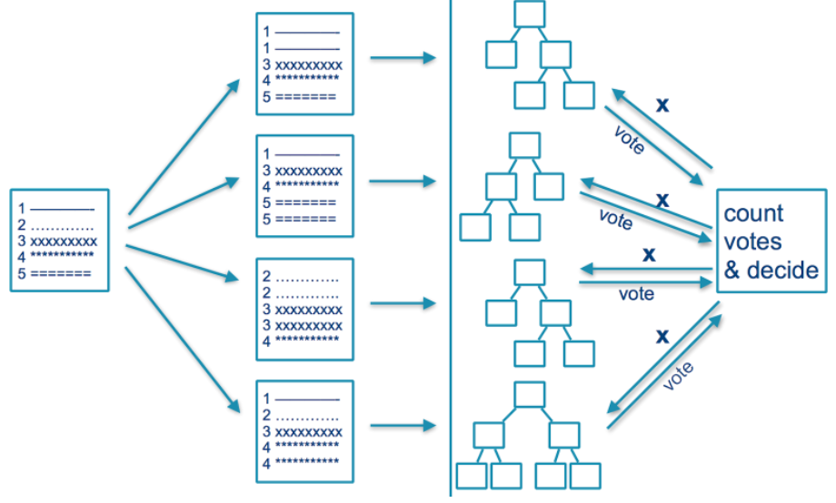

---
output:
   xaringan::moon_reader:
    css: xaringan-themer.css
    lib_dir: libs
    seal: false
    self_contained: true
    nature:
      highlightStyle: github
      highlightLines: false
      countIncrementalSlides: false
---

class: title-slide, center, middle
background-image: url(images/portada.jpg)
background-size: cover

#Práctica 5: 
Ensamble learning y Naive Bayes

```{r setup, include = FALSE}
options(htmltools.dir.version = FALSE)
knitr::opts_chunk$set(warning = FALSE)
knitr::opts_chunk$set(message = FALSE)
library(knitr)
library(tidyverse)
# set default options
opts_chunk$set(echo=FALSE,
               collapse = TRUE,
               fig.width = 7.252,
               fig.height = 4,
               dpi = 300)
xaringanExtra::use_tile_view()
xaringanExtra::use_scribble(pen_size = 2)
xaringanExtra::use_clipboard()
xaringanExtra::use_webcam(width = 210, height = 220)
xaringanExtra::use_share_again()
xaringanExtra::use_tachyons()
xaringanExtra::style_share_again(
  share_buttons = c("twitter", "linkedin", "pocket")
)
xaringanExtra::use_panelset()
```

```{r xaringan-extra-styles, include=FALSE}
xaringanExtra::use_extra_styles(
  hover_code_line = TRUE,         #<<
  mute_unhighlighted_code = TRUE  #<<
)
```


```{r xaringan-logo, echo=FALSE}

xaringanExtra::use_fit_screen()
xaringanExtra::use_logo(
  image_url = "images/logo.png"
)
```

```{r xaringan-themer, include=FALSE, warning=FALSE}
library(xaringanthemer)
style_mono_accent(
  base_color = "#1c5253",
  header_font_google = google_font("Josefin Sans"),
  text_font_google   = google_font("Open Sans", "400", "300i"),
  code_font_google   = google_font("Fira Mono")

)

colors = c(
  red = "#f34213",
  purple = "#3e2f5b",
  orange = "#ff8811",
  green = "#136f63",
  white = "#FFFFFF",
  black="000000"
)
```

---
## Hoja de ruta de la clase de hoy

--

### En la primera parte:

- Métodos de ensable: Bagging y Boosting

--

### **.orange[Recreo]** `r emo::ji("coffee")`🧉

--

### En la segunda parte:

- Gaussian y Multinomial Naive Bayes

---
class: inverse, middle, center

# Ensamble Learning

---

## Basados en Bagging

# Ensamble learning: Bagging

Los **.orange[árboles de decisión]** son algoritmos inestables debido a que pequeñas variaciones en el dataset pueden generar modelos muy diferentes.
--

.bg-washed-light-purple.b--light-purple.ba.bw2.br3.shadow-5.ph4.mt4[
**.orange[Bagging (Bootstrap Aggregation)]** es un método para hacer aprendizaje por _ensemble_.

Consiste en realizar K subsets del dataset aleatoriamente y con reemplazo, resultando en un _ensamble_ de K modelos. La asignación de la clase se realiza por mayoria simple en casos de clasificación.

]
---

# Bagging para árboles de decisión

.center[

]