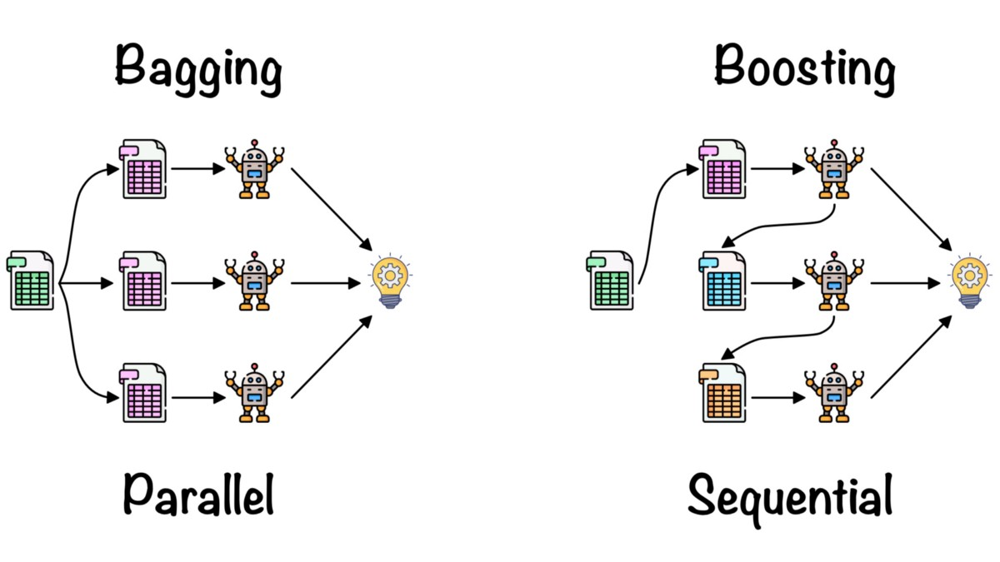

---
output:
   xaringan::moon_reader:
    css: xaringan-themer.css
    lib_dir: libs
    seal: false
    self_contained: true
    nature:
      highlightStyle: github
      highlightLines: false
      countIncrementalSlides: false
---

class: title-slide, center, middle
background-image: url(images/portada.jpg)
background-size: cover

#Práctica 5: 
## Ensamble learning y Naive Bayes

```{r setup, include = FALSE}
options(htmltools.dir.version = FALSE)
knitr::opts_chunk$set(warning = FALSE)
knitr::opts_chunk$set(message = FALSE)
library(knitr)
library(tidyverse)
# set default options
opts_chunk$set(echo=FALSE,
               collapse = TRUE,
               fig.width = 7.252,
               fig.height = 4,
               dpi = 300)
xaringanExtra::use_tile_view()
xaringanExtra::use_scribble(pen_size = 2)
xaringanExtra::use_clipboard()
xaringanExtra::use_webcam(width = 210, height = 220)
xaringanExtra::use_share_again()
xaringanExtra::use_tachyons()
xaringanExtra::style_share_again(
  share_buttons = c("twitter", "linkedin", "pocket")
)
xaringanExtra::use_panelset()
```

```{r xaringan-extra-styles, include=FALSE}
xaringanExtra::use_extra_styles(
  hover_code_line = TRUE,         #<<
  mute_unhighlighted_code = TRUE  #<<
)
```


```{r xaringan-logo, echo=FALSE}

xaringanExtra::use_fit_screen()
xaringanExtra::use_logo(
  image_url = "images/logo.png"
)
```

```{r xaringan-themer, include=FALSE, warning=FALSE}
library(xaringanthemer)
style_mono_accent(
  base_color = "#1c5253",
  header_font_google = google_font("Josefin Sans"),
  text_font_google   = google_font("Open Sans", "400", "300i"),
  code_font_google   = google_font("Fira Mono")

)

colors = c(
  red = "#f34213",
  purple = "#3e2f5b",
  orange = "#ff8811",
  green = "#136f63",
  white = "#FFFFFF",
  black="000000"
)
```

---
## Hoja de ruta de la clase de hoy

--

### En la primera parte:

- Métodos de ensamble: Bagging y Boosting

--

### **.orange[Recreo]** `r emo::ji("coffee")`🧉

--

### En la segunda parte:

- Gaussian y Multinomial Naive Bayes

---
class: inverse, middle, center

# Ensamble Learning

---

## Ensamble Learning: Motivación

Se basan en la idea de que el trabajo en conjunto debería dar mejores resultados.

--

Habitualmente, un modelo "ensemble" es más preciso que los modelos que lo constituyen. Intuitivamente, esto se debe a que "dos aprenden mejor que uno".

--

.bg-washed-light-purple.b--light-purple.ba.bw2.br3.shadow-5.ph4.mt4[
Con los métodos de ensemble se pueden combinar múltiples modelos en uno nuevo y así lograr un equilibro entre **.orange[sesgo y varianza]**, y por ende conseguir mejores predicciones que cualquiera de los modelos individuales originales.
]
---
# Ensamble learning: Bagging

Los **.orange[árboles de decisión]** son algoritmos inestables debido a que pequeñas variaciones en el dataset pueden generar modelos muy diferentes.
--

.bg-washed-light-purple.b--light-purple.ba.bw2.br3.shadow-5.ph4.mt4[
**.orange[Bagging (Bootstrap Aggregation)]** es un método para hacer aprendizaje por _ensemble_.

Consiste en realizar K subsets del dataset aleatoriamente y con reemplazo, resultando en un _ensamble_ de K modelos. La asignación de la clase se realiza por mayoria simple en casos de clasificación.

]
---

## Bagging para árboles de decisión

.center[

]

.footnote[Imagen de Hendrik Blockeel]

---
# Random Forest

- Es una modificación a Bagging para Árboles de Decisión. 

--

- En cada árbol se consideran sólo **M atributos** elegidos aleatoriamente y sin reposición.

--

- El algoritmo es sencillo, fácil de implementar, fácil de usar y requiere de poco ajuste de parámetros.

--

- Es menos interpretable que los árboles de decisión.

---
class: inverse, middle, center

#`r emo::ji("computer")`
### Ejemplo en Colab!

---

# Ensamble learning: Boosting

.center[

]

.footnote[Imagen extraída de [aquí](https://datascience.eu/machine-learning/gradient-boosting-what-you-need-to-know/)]

---
# Bagging vs Boosting

.center[

]

.footnote[Imagen extraída de [aquí](https://towardsdatascience.com/ensemble-learning-bagging-boosting-3098079e5422)]

---
class: inverse, middle, center

#`r emo::ji("computer")`
### Ejemplo en Colab!

---
class: inverse, middle, center

## Descanso `r emo::ji("party")` `r emo::ji("coffee")`🧉

```{r}
library(countdown)
countdown(minutes = 15, seconds = 0, font_size="7em", color_background = "white")
```

---
class: inverse, middle, center

# Naive Bayes

---

# Teorema de Bayes

.bg-washed-light-purple.b--light-purple.ba.bw2.br2.shadow-5.ph3.mt2[
.center[
$\LARGE P(A|B)= \frac{P(B|A) * P(A)}{P(B)}$
]
]

El teorema establece que se puede encontrar la probabilidad de **A** (e.g. una clase objetivo) dada la ocurrencia de B (e.g. un conjunto de features). Es decir, B es la evidencia y A es la hipótesis.

--

_.orange[Dada nuestras variables predictoras, ¿cuál es la probabilidad de cada clase?
]_

.center[
$\ P(Clase|Predictores)= \LARGE \frac{P(Predictores|Clase) * P(Clase)}{P(Predictores)}$

$\LARGE = \frac{Prior * Likelihood}{Evidencia}$

$\ Predictores= \LARGE (x_1, x_2, x_3...x_n)$
]

---

#¿Porqué Naive?

La principal asunción es que **.purple[los atributos son independientes entre sí.]**

Una segunda asunción, es que **.purple[todos los atributos tienen el mismo efecto en la salida del algoritmo.]**

###Entonces...

.center[
$\ P(y|x_1, x_2..x_n)= \LARGE \frac{P(x_1|y) * P(x_n|y)...P(x_1|y)* P(y)}{P(x_1)* P(x_2)...P(x_N)}$
]

---
# Tipos de algoritmos

**.orange[Bernoulli Naive Bayes]**: Para casos donde los atributos son variables binarias (e.g. si una palabra ocurre o no en un documento).

--

**.orange[Multinomial Naive Bayes]**: Para casos donde los atributos representan frecuencias (e.g. la cantidad de veces que una palabra ocurre en un documento).

--

**.orange[Gaussian Naive Bayes]**: Para casos donde los atributos toman valores continuos, se asume que los valores son muestras de una distribución gaussiana (esto se usa para calcular las probabilidades condicionales en el algoritmo).

